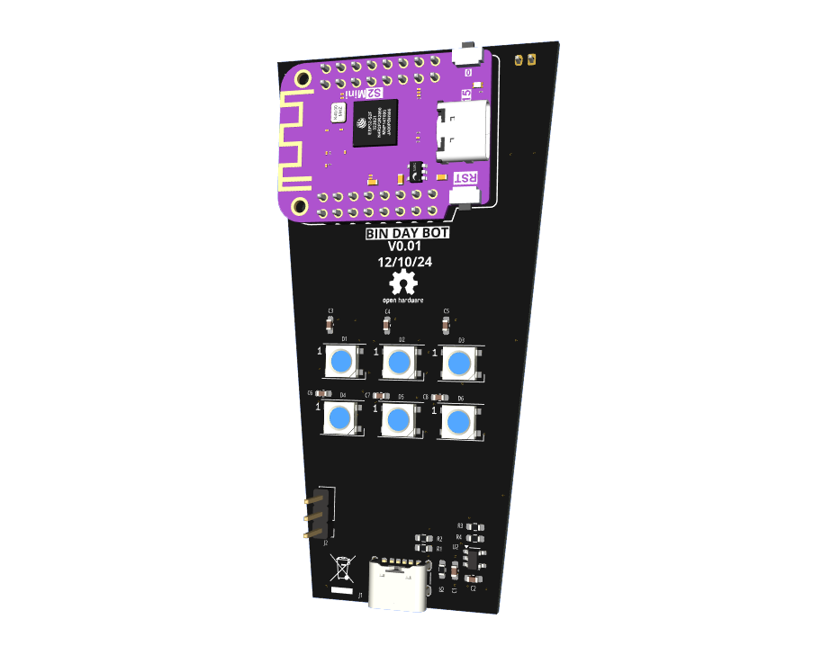

# Bin Day Bot

Bin Day bot is a simple bot that will remind you when to put your bins out. On Binday it will glow the colour of the bin you need to put out. It will also remind you the night before.

The PCB is designed to fit into [This model by BrewStew](https://www.thingiverse.com/thing:3377785). 

Currently it only works on the York City Council waste API but I am working on making it more universal.

## Software

To be added when PCBs arrive.

---
### License

Software is licensed under the [CC-BY-SA-4.0 license](https://creativecommons.org/licenses/by-sa/4.0/).

Hardware is licensed under the CERN Open Hardware Licence v1.2 - see the [LICENSE.md](LICENSE.md) file for details. This complies with the requirements of the [Open Source Hardware Association](https://www.oshwa.org/definition/).

Documentation is licensed under the [CC-BY-SA-4.0 license](https://creativecommons.org/licenses/by-sa/4.0/).